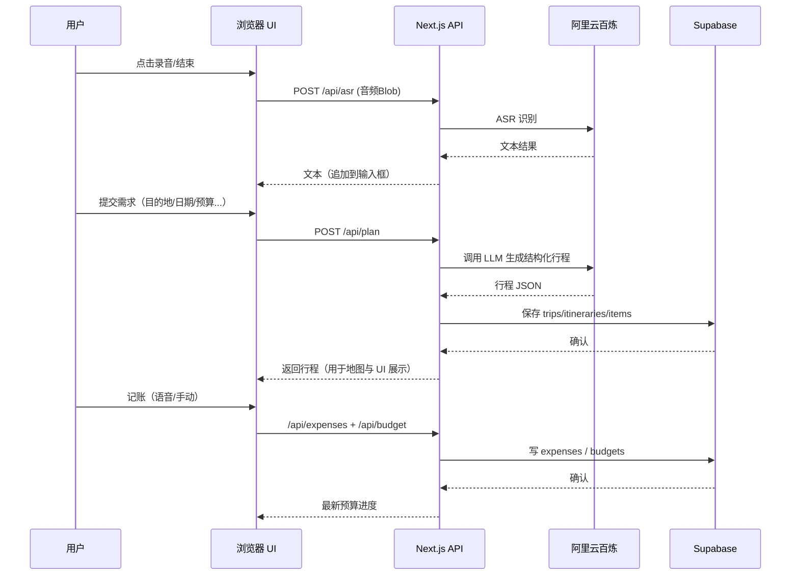

# 02. 架构设计

## 总体架构
```mermaid
flowchart LR
  subgraph Browser[Web 浏览器]
    UI[Next.js App (RSC+CSR)] -- 录音/上传 --> ASRClient[语音上传器]
    UI -- 交互/展示 --> Map[AMap JS SDK]
  end

  subgraph NextApp[Next.js 服务器 (Node)]
    APIPlan[/api/plan]
    APIASR[/api/asr]
    APIBudget[/api/budget]
    APIExpense[/api/expenses]
    Auth[Supabase Auth Helpers]
  end

  subgraph Supabase[Supabase]
    DB[(Postgres + RLS)]
    Storage[(Storage)]
    AuthSvc[Auth]
  end

  subgraph Aliyun[阿里云百炼 DashScope]
    ASR[(ASR: paraformer)]
    LLM[(LLM: Qwen)]
  end

  Browser -- fetch --> NextApp
  NextApp -- JWT/Session --> Supabase
  APIPlan -- 调用 --> LLM
  APIASR -- 调用 --> ASR
  NextApp <-- RLS/SQL --> DB
```

说明：
- 前端采用 Next.js App Router。语音录制在浏览器完成，音频通过 `/api/asr` 上传到服务器，再由服务器调用阿里云百炼 ASR。
- 行程规划通过 `/api/plan` 调用阿里云百炼 LLM（Qwen 系列），并在服务端整合地图与业务规则，返回结构化行程方案。
- 数据持久化在 Supabase（Postgres），通过 RLS 做行级权限控制。
- 地图使用高德 JS SDK 在浏览器侧渲染，路线规划/标注与页面联动。

## 技术选型
- Next.js + TypeScript + TailwindCSS
- UI 组件：shadcn/ui（Radix）
- Supabase：`@supabase/supabase-js` + Auth Helpers for Next.js
- 阿里云百炼：DashScope SDK/HTTP（ASR、LLM）
- 高德地图：`@amap/amap-jsapi-loader`（或官方 Loader）

## 组件与数据流


## 权限与安全
- Supabase RLS：所有行程/支出均绑定 `user_id`，策略仅允许当前用户访问自己的数据。
- 密钥：
  - 不提交在仓库；本地通过 `.env.local` 注入，生产通过环境变量或运行时设置页输入。
  - 用户自带的 API Key（可选）：使用服务端加密后存库，或仅会话级存储（不落库）。
  - 推荐使用 Postgres `pgcrypto` 或 KMS（如有）进行加密。
  - 高德地图：前端 JS SDK 使用受域名白名单与 `securityJsCode` 保护的公开 Key；涉及路线/地理编码等 REST 服务改走服务端代理并使用私密 `AMAP_REST_KEY`。
- CSRF/XSS：采用 Next.js 默认防护、严格的内容安全策略（CSP）与对外 API 白名单校验。

## 错误处理与重试
- 对阿里云百炼调用：超时/重试（指数退避）、错误码映射友好提示。
- 对地图服务：降级策略（仅展示基础坐标/无路线）并提示刷新。
- API 统一错误响应结构：`{ code, message, details? }`。

## 性能与体验
- 生成行程采用流式响应（LLM 支持时），前端增量渲染关键片段。
- 地图渲染虚拟化：仅高亮当日/当前卡片的点与路线。
- 缓存：用户最近 3 次成功生成的行程做服务端缓存（Hash Key 基于目的地+天数+偏好）。

## 可观测性
- 日志：API 访问日志、错误日志；屏蔽敏感字段。
- 关键指标：生成耗时、ASR 成功率、地图交互错误率、预算写入成功率。
